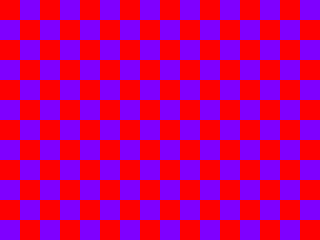
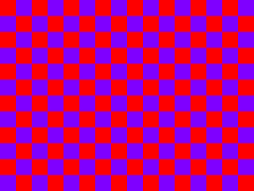
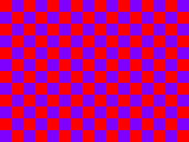
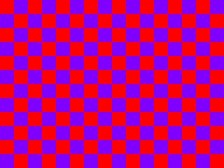

Example Images
==============

This directory contains example JPEG files and PNG source files.

## Image Credits

### Photos by Author

These images are taken by [Shunsuke Michii](https://github.com/harukasan).
These photos are licensed under the Creative Commons Attribution 3.0.
You can also use these images under the same as [go-libjpeg's license](../LICENSE).

#### cosmos.png

The cosmos taken in Nokono-shima (Nokono Island), Fukuoka, JAPAN.


JPEG file is generated by following command:

```sh
$ convert -quality 90 -sampling-factor 4:2:0 ./cosmos.png ./cosmos.jpg
```

#### kinkaku.png

Kinkaku taken in Kyoto, JAPAN.


JPEG file is generated by following command:

```sh
$ convert -quality 90 -sampling-factor 4:2:0 ./kinkaku.png ./kinkaku.jpg
```


### Checkerboard

Blue and Red Checkerboards in each subsampling factor.


Each images are converted by following commands:

```
$ convert checkerboard.png -sampling-factor 4:4:4 -quality 100 ./checkerboard_444.jpg
$ convert checkerboard.png -sampling-factor 4:4:0 -quality 100 ./checkerboard_440.jpg
$ convert checkerboard.png -sampling-factor 4:2:2 -quality 100 ./checkerboard_422.jpg
$ convert checkerboard.png -sampling-factor 4:2:0 -quality 100 ./checkerboard_420.jpg
```

#### in 4:4:4



#### in 4:4:0



#### in 4:2:2



#### in 4:2:0


